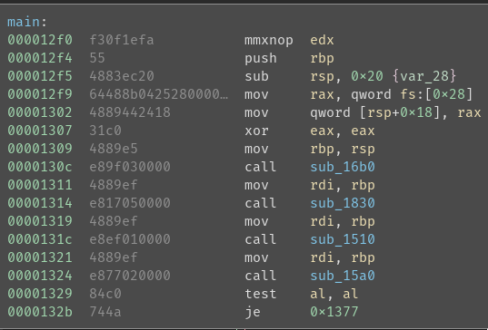
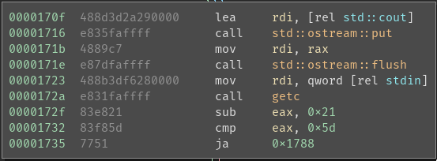
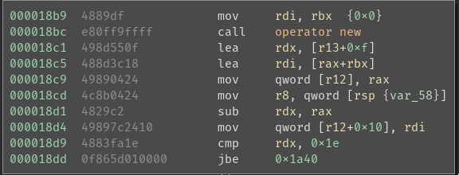
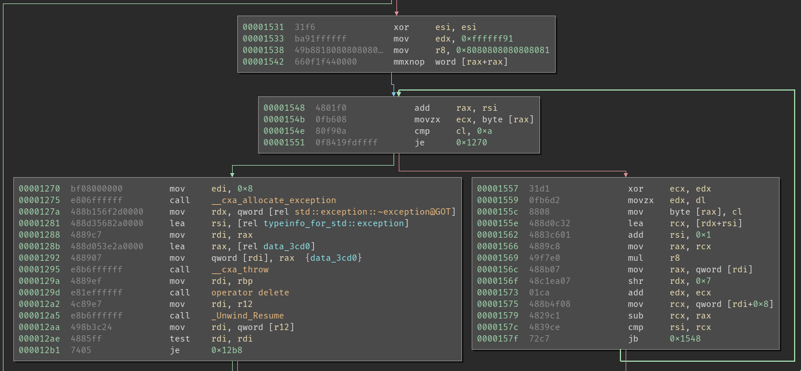
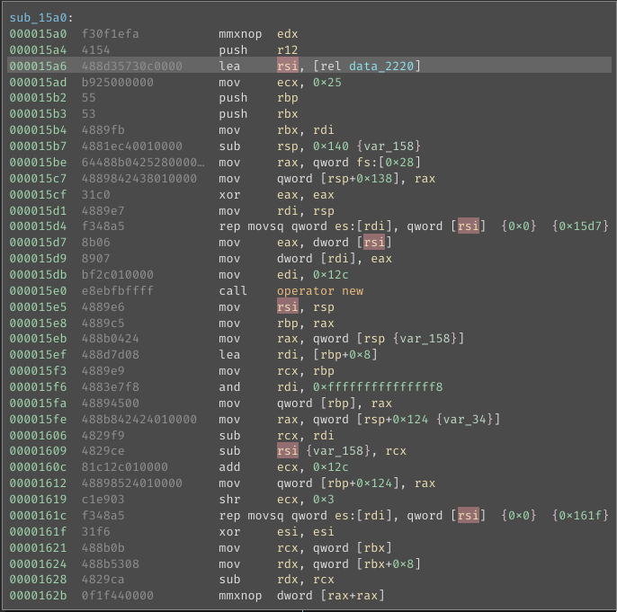

# RE 100 - little_engine

| Author | novafacing |
| --- | --- |
| Point Value | 100 |
| Description | C++ Input transformation cipher checker |

*Note:* This challenge was harder than intended due to a mixup with makefiles. I intended to distribute non-stripped, non-optimized REV chals. Then, in testing, I did the opposite. My bad.


I took a bit of a weird approach with this CTF and started with Go/C++ and moved towards C as the challenges got harder. Regardless, this challenge is reasonably simple once we uncover the functionality!

Let's start by opening the binary up in a disassembler. I'm using Binary Ninja, but you should have a good experience with GDB/R2/Ghidra/IDA/Binja, whichever you like better. 

This binary, `engine` is stripped and gcc-optimized, but that won't interfere too much with our reversing. Honestly that was just because my function names were *too* helpful. If we run the binary, we can correlate the actions in `main()`. 

We get the following:

```
> ./engine
Welcome! We're doing things a little differently here, you're going to tell me a tidbit about trains. Are you ready?

Hey now, what're you trying to pull over on me, conductor?
Now, I hope you're a total trainiac. Give me your best tidbit:
```
If we put in `pctf{thisisaflag}` we get:

```
I guess you don't know anything about trains...go do some TRAINing you non-conductor :(
```

So this is an input checker, should be simple. We have three function calls in main. 



Followed by a test and a jump to either the correct text or the fail text.

Let's examine those three functions.

The first, `<sub_16b0>` is just the function that handles printing the flavor text for the challenge. We can safely ignore it, although it does check that the value from its `getc()` call is printable ASCII for...some reason.



The second, `<sub_1830>` contains our input function, which reads from std::cin into a string, then creates a new vector from that string:



And returns the vector.

The third function, `<sub_1510>` has the first of the two pieces of functionality we really care about:



The first part of this loop checks to see if the current byte (in ecx) is a newline (0xa) and if it is, throws an exception.

The second part xors the first byte with the value 0x91, then adds the current index to the value, then shifts the value right by 0x7. This effectively contrains that value to a maximum of 0xff, so this is basically a mod by 0xff. So if we break this down into pseudocode:

```
modifier = 0x91
foreach byte in input:
	if byte is 0xa:
		throw exception
	byte = byte ^ modifier
	modifier = modifier + index(byte) % 0xff
```

Great! We know how our input is being transformed, now let's move on and see how the input is checked in function `<sub_15a0>`:

In the start of the function, we load up some data:



The data is a block of bytes starting with 0xe1, and we grab that address into rsi. We also move our input address through into rdx. We then iterate from both addresses, comparing the values at each. We add 0x1 to rsi (our input index) each loop and we add 4 * rsi to the data we're checking against. So, we can grab that to pseudocode:

```
for byte in input:
	if byte == data[index(byte) * 4]:
		continue
	else:
		break
```

So now we can go backward, if we grab every 4th byte from that data in the binary, we get the following vector:

{0xe1, 0xf2, 0xe6, 0xf2, 0xec, 0xef, 0xc8, 0x95, 0xf2, 0xd8, 0x8e, 0xac, 0xe0, 0xad, 0x82, 0xa5, 0x79, 0x6e, 0x18, 0x09, 0x3d, 0x3b, 0x4a, 0xe1, 0xc1, 0x8f, 0xb9, 0xc2, 0x52, 0x5e, 0x72, 0x51, 0xdc, 0x92, 0xaa, 0x90, 0x39, 0x40, 0x27, 0x4a, 0xc4, 0x97, 0xc0, 0x72, 0x18, 0x42, 0x96, 0xf7, 0xc5, 0x71, 0x3d, 0xe4, 0x90, 0xa7, 0x5a, 0x0c, xa8, 0x8c, 0x6f, 0x74, 0xf1, 0xca, 0xa4, 0x0a, 0x17, 0x8a, 0xa5, 0x54, 0xee, 0x9b, 0x3b, 0x69, 0xa3, 0xef, 0x54, 0x44}

So we can decipher that with the following python:
```
start = 0x91
first = True
print(chr(0xe1 ^ start), end="")
for idx, v in enumerate([0xf2, 0xe6, 0xf2, 0xec, 0xef, 0xc8, 0x95, 0xf2, 0xd8, 0x8e, 0xac, 0xe0, 0xad, 0x82, 0xa5, 0x79, 0x6e, 0x18, 0x09, 0x3d, 0x3b, 0x4a, 0xe1, 0xc1, 0x8f, 0xb9, 0xc2, 0x52, 0x5e, 0x72, 0x51, 0xdc, 0x92, 0xaa, 0x90, 0x39, 0x40, 0x27, 0x4a, 0xc4, 0x97, 0xc0, 0x72, 0x18, 0x42, 0x96, 0xf7, 0xc5, 0x71, 0x3d, 0xe4, 0x90, 0xa7, 0x5a, 0x0c, 0xa8, 0x8c, 0x6f, 0x74, 0xf1, 0xca, 0xa4, 0x0a, 0x17, 0x8a, 0xa5, 0x54, 0xee, 0x9b, 0x3b, 0x69, 0xa3, 0xef, 0x54, 0x44]):
        start = (start + idx) % 0xff
        print(chr(v ^ start), end="")
```

And we get the flag:

`pctf{th3_m0d3rn_st34m_3ng1n3_w45_1nv3nt3d_1n_1698_buT_th3_b3st_0n3_in_1940}`
