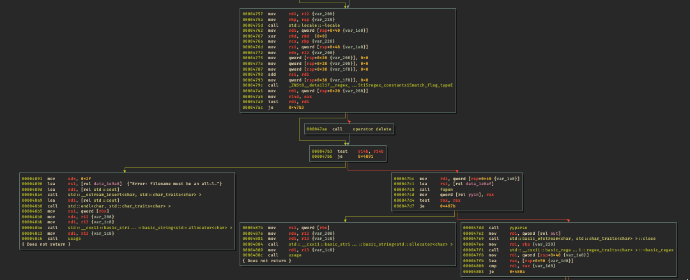
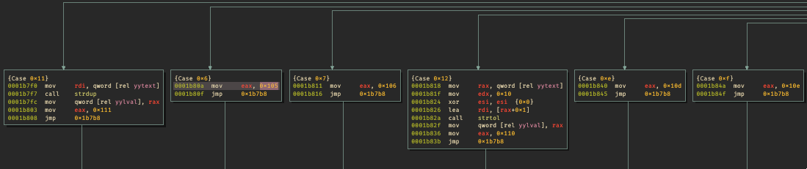
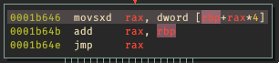
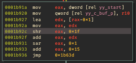
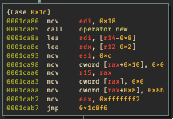
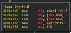

# REV 300 - prerailed

| Author | novafacing |
| --- | --- | 
| Point Value | 300 |
| Description | Reversing an assembler |

*Warning*: Yes, the intended solution to this challenge is "read and understand the source code of flex (https://github.com/westes/flex) and bison (https://github.com/akimd/bison). Yes, that's some bullshit. Nobody solved it, if it makes you feel better. I was barely able to solve it, and I *wrote* the challenge. Anyway, let's dive in.

This challenge is an introduction to the challenge railed. I added it because I felt that the two components in railed were too much for one challenge and that players should get 300 points for getting to the halfway point. This is that point! 

So we get three binaries. We're told that we don't need to RE railed at all, binary is literally just...data. Prerailed is an ELF and we're not told not to touch that one, so let's crack it open and figure out how it works.

If we run it `./prerailed` we'll get a usage message saying it takes a file.

If we do the obvious and run `./prerailed binary` it will actually overwrite binary with a file containing nothing. Oops!

If we `xxd binary` there's nothing immediately obvious about what it could be. There's a lot of zeroes but otherwise it's mostly just seemingly random bytes.

So that's not the solution, let's RE `prerailed`.

I used binary ninja for this one. Sorry. Steps should be reproducible in GHidra and r2 though.

Let's open up main. It's pretty simple. We get an argument and it does some error checking with std::regex:



These basically just end up being error handling. It checks that the regex of lowercase only matches, checks that the file can be opened, and if it can calls yyparse on the file after setting the special bison (AKA Yacc 2.0) variable yyin to the file pointer.

We then call yyparse. If you've ever *written* a parser you'll know they're tempremental and painful. Reversing them is no different. Here's the graph:


So it's basically a huge jump table. Luckily for us there's a commonality here. Most (not all) of these jump table parts call new(0x18). That means we're really only operating with one top level data structure:

The loop goes from `0x1c847` to `0x1d180`. Each time it gets a token from yylex() (called pretty much at the top of each yyparse() loop) it does something. So first let's look at yylex() and see what the available tokens are.

So oof. yylex is pretty bad too. But it looks worse than it is. Let's dive in. First, we have some up front processing. We check to see if yylex has been initialized (yy_init == 1). If not, we initialize it. No need for us to look at that too much. You can find source code for that [here](https://github.com/westes/flex/blob/8b1fbf674f2e038df9cf1fe7725617e3837ae2a9/src/flex.skl#L1220) if you're curious. My recommendation is not to be. 


Next we have some processing lex does to keep track of where it was and where it is. Also not a terribly interesting thing for us until that last block where we get yytext. yytext is the most important variable to track here, because it holds the actual bytes lex has grabbed from this token. In order to reverse lex, we need to understand that it is a DFA. We can basically say that means that as it moves along the input, it will reach different states. When a state terminates, that's a "token" and it is returned up to the parser. For example, if we have a simple parser with one rule:

"k" { return TOKEN_K; }
"[^k]" { /* ignore */ };

For anything except k, we will simply continue to parse. If the DFA arrives at state "k", it will return that token because that state terminates. You can read the lex source to see exactly how this works but for our purposes that understanding is sufficient.

Inside our lexer jump table we have a lot of cases that look like this:



Let's go from simplest to least simple and build out simplified table, shall we? The simplest jump table entries are of the form:

```
mov eax, 0x<something>
jmp 0x1b7b8
```
These are the lexer cases that represent a single token like the above case "return TOKEN_K". There are more complex operations available involving returning actual data types, but the majority of cases will just return that identifier. So we can quickly build out the table for them:

```
0x3:  0x102
0x4:  0x103
0x5:  0x104
0x6:  0x105
0x7:  0x106
0x8:  0x107
0x9:  0x108
0xa:  0x109
0xb:  0x10a
0xe:  0x10d
0xf:  0x10e
0x10: 0x10f
0xc:  0x10b
0xd:  0x10c
```

If we look at this location: 



We'll see that the variable we are jumping based from is equivalent to rbp+[rbp+rax*4]. That *4 tells us this is a 32-bit value. Where does it come from? If we look at the code below case 0x14 in the jump table, we'll see the actual main logic of yylex. We want to pay particular attention to the value in rax at the end of the block:



It is also much easier to understand what is happening here if we know what all of flex's internal variables are and do. Here are most of them:

```
FILE * yyin: input file (in our case the open file descriptor we passed as arg)
int yyleng: length of current yytext (note yytext is replaced every call to yylex)
char * yytext: The buffer containing the current token
static char * yy_last_accepting_cpos: character pointer to last accepting state
static YY_CS_TYPE yy_last_accepting_state: 
int yy_init: whether flex has been initialized
char * yy_c_buf_p: Pointer to current character in current buf
int yy_n_chars: Number of chars in current buffer
YY_BUFFER_STATE * yy_buffer_stack: Holds the stack of buffers scanned so far
size_t yy_buffer_stack_top: (index if you will) of the top element of the buffer stack
size_t yy_buffer_stack_max: Same as above but holds max size of bufstack
char * yylval: Contains the lookahead's semantic value (only when yychar not YYEOF or YYEMPTY)
char yychar: contains either the next lookahead token or YYEOF when lookahead is EOS
```

That should be good. So knowing this we can go through (I'm not going to do it here in exhausting detail. If you're still reading you can do it as an exercise) the lexer logic. Once you've done that, come back and we'll finish looking at our states. We have two special case states that don't actually "return" in the sense we've been looking at: 


Case 0x13 does: fwrite((void *)yytext, yyleng, 1, yyout), then loops back to the top of our per-loop processing. This is effectively just an echo of whatever the current token was. 

Case 0x11 calls strdup on yytext and assigns the pointer to yylval, then jumps to the terminating state. 

Case 0x12 calls strtol on yytext and assigns the pointer to yylval, then jumps to the terminating state. 

Case 0x1 and 0x2 both just skip over the characters in question. 

So, we now have our full table of possibilities. All we need to do is correlate the table to the actual strings in question. 

Luckily for us, FLex is open source, so we can just get the template for a lexer. This is the top:

```
yy_state_type yy_current_state;
        char *yy_cp, *yy_bp;
        int yy_act;

        if ( !(yy_init) )
                {
                (yy_init) = 1;

#ifdef YY_USER_INIT
                YY_USER_INIT;
#endif

                if ( ! (yy_start) )
                        (yy_start) = 1; /* first start state */

                if ( ! yyin )
                        yyin = stdin;

                if ( ! yyout )
                        yyout = stdout;

                if ( ! YY_CURRENT_BUFFER ) {
                        yyensure_buffer_stack ();
                        YY_CURRENT_BUFFER_LVALUE =
                                yy_create_buffer( yyin, YY_BUF_SIZE );
                }

                yy_load_buffer_state(  );
                }

        {
#line 23 "preprocessor.l"


#line 731 "lex.yy.c"

        while ( /*CONSTCOND*/1 )                /* loops until end-of-file is reached */
                {
                yy_cp = (yy_c_buf_p);

                /* Support of yytext. */
                *yy_cp = (yy_hold_char);

                /* yy_bp points to the position in yy_ch_buf of the start of
                 * the current run.
                 */
                yy_bp = yy_cp;

                yy_current_state = (yy_start);
yy_match:
                do
                        {
                        /* YY_SC_TO_UI literally just makes an unsigned int from a char */
                        /* yy_ec is an array telling lex where to go */
                        YY_CHAR yy_c = yy_ec[YY_SC_TO_UI(*yy_cp)] ;
                        if ( yy_accept[yy_current_state] )
                                {
                                (yy_last_accepting_state) = yy_current_state;
                                (yy_last_accepting_cpos) = yy_cp;
                                }
                        while ( yy_chk[yy_base[yy_current_state] + yy_c] != yy_current_state )
                                {
                                yy_current_state = (int) yy_def[yy_current_state];
                                if ( yy_current_state >= 77 )
                                        yy_c = yy_meta[yy_c];
                                }
                        yy_current_state = yy_nxt[yy_base[yy_current_state] + yy_c];
                        ++yy_cp;
                        }
                while ( yy_base[yy_current_state] != 97 );

yy_find_action:
                yy_act = yy_accept[yy_current_state];
                if ( yy_act == 0 )
                        { /* have to back up */
                        yy_cp = (yy_last_accepting_cpos);
                        yy_current_state = (yy_last_accepting_state);
                        yy_act = yy_accept[yy_current_state];
                        }

                YY_DO_BEFORE_ACTION;

do_action:      /* This label is used only to access EOF actions. */

                switch ( yy_act )
        { /* beginning of action switch */
                        case 0: /* must back up */
                        /* undo the effects of YY_DO_BEFORE_ACTION */
                        *yy_cp = (yy_hold_char);
                        yy_cp = (yy_last_accepting_cpos);
                        yy_current_state = (yy_last_accepting_state);
                        goto yy_find_action;
```

This switch will have cases corresponding to the 0x0-0x15 values we've already found. There are a couple of arrays we need to have that represent the state transitions of the DFA. We need yy_def, yy_ec, yy_accept, yy_nxt, yy_base, yy_def, and yy_meta.

We can extract all of those from the binary, I'm not going to paste them here for space (I'm already taking too long!).

I'll give an example of figuring out an input token from one of the jump tables. Lets take a simple token as an example, case 0x4. 
If we look at case 0x4, we're simply returning 0x103 once we reach an accepting state. This is the token type defined by flex at "flextime :)" and goes into an enum like:

```
/* Token type.  */
#ifndef YYTOKENTYPE
# define YYTOKENTYPE
  enum yytokentype
  {
    TOKEN_MPC = 258,
    TOKEN_HCF = 259,
    TOKEN_ENQ = 260,
    TOKEN_DEQ = 261,
    TOKEN_JSZ = 262,
    TOKEN_ALLRMPRCIVRI = 263,
    TOKEN_MOOQ = 264,
    TOKEN_RV = 265,
    TOKEN_LAR = 266,
    TOKEN_AML = 267,
    TOKEN_GML = 268,
    TOKEN_SQ = 269,
    TOKEN_EMP = 270,
    TOKEN_SEMICOL = 271,
    TOKEN_IMM = 272,
    TOKEN_REG = 273
  };
#endif
```

Doesn't matter, that basically just tells yyparse() down the road what to do with the token. How do we know we're in case 0x4? Well, as in the code above for yylex, we can go backwards. We know we have yy_act == 0x4 when we reach the switch statement. yy_act = yy_accept[yy_current_state] and we know yy_accept, so we can find the last state in this DFA scan. Only one state in yy_accept holds the value 4, so we know our yy_current_state at the end is 46. what modifies yy_current_state before that?

```
yy_current_state = yy_nxt[yy_base[yy_current_state] + yy_c];
```

We know yy_current_state is 46 at this point, so we can look up in yy_nxt. Again, there is only one entry at index 79. We know:

```
79 == yy_base[yy_current_state] + yy_c]
```
Where yy_c is the entry based on the yy_ec array indexed by the current input character. We know yy_c is one of the elements of the array and we know all of the entries in yy_base, so in order to determine yy_c (and therefore *yy_cp) all we need to do is enumerate the possible combinations that can add up to 79. There are no negative values, so this is actually a pretty short list. We can reduce it even further by eliminating the non-1 values in yy_ec, as these are indicative of non-state characters (or, more precisely, ignored characters). Now keep in mind, this is simply a guess based on the frequency, but if you create some example lexers you'll notice this pattern.

We can use that to write a z3 script that'll solve for the possibilities of each iteration, and we can then use that to figure out what the actual input is for the token. Keep in mind that some tokens will have multiple possible inputs!

I realized when I released this challenge, however, there's a MUCH easier way to recover the tokens: just list the functions in railed. So I'm going to leave the rest of the lext part of the writeup open ended because this is already long enough. Z3 or use your resources: up to you. Either way you'll end up with the list of tokens in preprocessor.l.

Let's move on to the fun part: yyparse! We'll reference the above table of tokentype for this.

flex is a DFA, bison is similar but uses what's called a pushdown automata. That just means it has a stack. As hackers, I'm sure you're familiar. Anyway before we look into the actual parser logic let's look at the data structures used. We have one of size 0x18. 



So...that structure looks a LOT like the `binary` file we're given. We can confirm by looking at:


So yeah, our top level parser rule takes whatever the sub rule is and writes out the values returned by the object above it. So in order to figure out what that object is, let's look at how it writes it out. We have an ofstream called "out", and luckily we don't have to deal with operator overloading, the write method is used. std::write(char * buf, size_t sz). We can backward slice our call to figure out that we're writing out the first 8 bytes from a pointer, then if the next 8 bytes from the pointer is not zero, we loop (that number) times and write out 8 bytes each time using the third 8 bytes from the structure as a pointer. So, to clean that up:

```
struct thing {
    int64_t some_id;
    int64_t size;
    int64_t * ptr_to_stuff_of_size_size;
}
```

The size is never written out, but this is deterministic (because otherwise we could be pretty certain the challenge wouldn't work), so we can assume that each identifier will correspond to a size as well. So all we need to reconstruct the structures is A) the identifier->size mapping (which if you're following along and have gone through REing the lex bit, you'll realize are opcodes), the opcode->text mapping (which we will get from the parser), and what the instruction format looks like (delimiters, etc).

So what we're looking for is each constructor and its corresponding opcode. We look for lines like 

`mov qword [r15+0x8], 0x91` 
`mov qword [r15+0x8], 0x90` 
`mov qword [r15+0x8], 0x89` 

These lines are the opcodes, they're the only static number that is unique. Next thing is to look at case 0x25. This case is pretty long because there was some optimization and several cases got squished in here and the strcmp that was in the code got optimized out because it was only 2 byte comparisons. Anyway, we can see that eax is set to 72 at the beginning and then the character from r9 is compared against it. This is "r". We check the second character (by subtracting and then testing zero) against "a, b, c, d, e". So we have the available tokens "ra", "rb", "rc", "rd", and "re", sounds like registers to me. These, by the way, will be in yytext as a char * if you remember from the lexer. 

So it's not likely that case 0x25 will return directly to the toplevel. We can assemble the descent levels (I say descent loosely, this is an iterative parser) by using the yytable data structure as well as the last piece of the puzzle:



For some cases, we simply return the dereferenced union pointer from yylval. This is odd until we remember that one of our lexer rules just returns a pointer to an int64_t. So we now know that this grammar accepts: mnemonics, registers, and immediates.

We can figure out what order it accepts them in by looking at each case and the sizes and values of the created structure. 

From there we can obtain a mapping from written opcode/values back to the input assembly language, and we'll have solved it!

The flag is obtained by doing so and then running the assembly. The flag will simply be printed in hex at the end.
