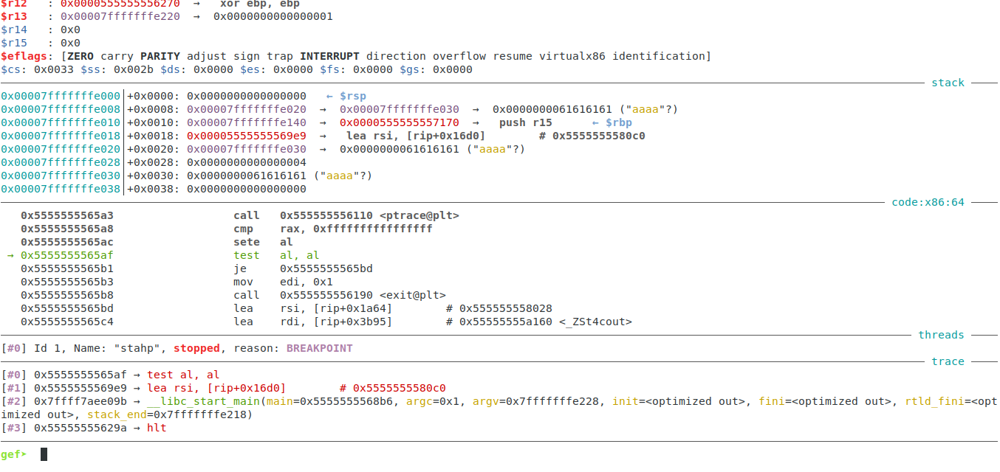
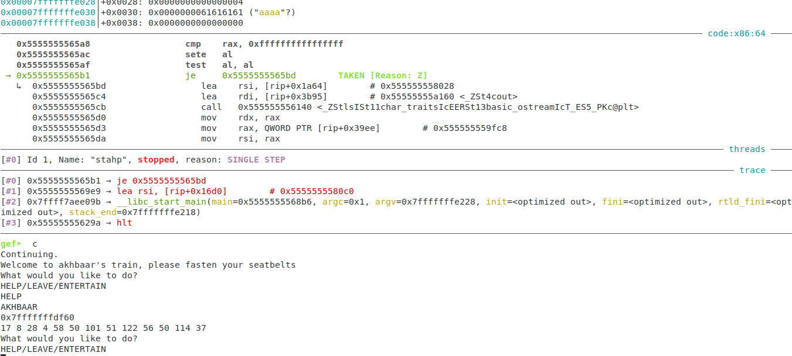
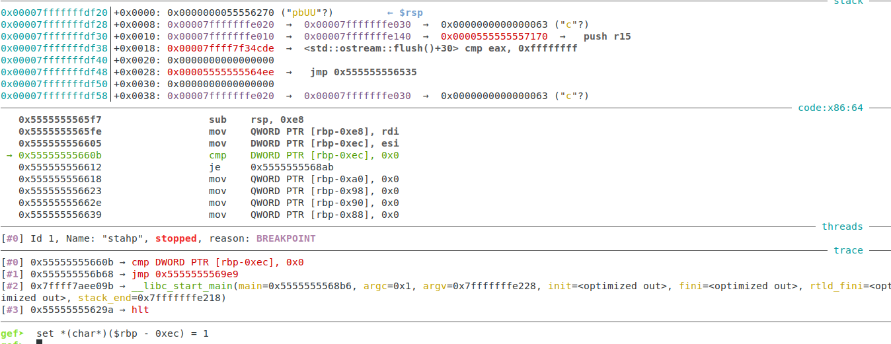
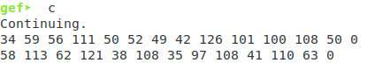

After entering your social security /national ID number, the binary will exit if debugging is detected.


To defeat this, we can change the result of the comparison at address 0x5555555565af


After this, calling HELP leaks the key (AKHBAAR) and part of the flag



To get the rest of the encoded flag to print, we must call HELP again patch the check at 0x55555555660b



Doing so will then give us the remaining flag chunks



These flag chunks are the encoded output of a rolling XOR of the key AKHBAAR and the flag
The code for undoing this is as follows
```
arr1 = [17 ,8 ,28 ,4 ,58 ,50 ,101 ,51 ,122 ,56 ,50 ,114 ,37, 127]
arr2 = [34 ,59 ,56 ,111 ,50 ,52 ,49 ,42 ,126 ,101 ,100 ,108 ,50]
arr3 = [58 ,113 ,62 ,121 ,38 ,108 ,35 ,97 ,108 ,41 ,110 ,63]
key = "AKHBAAR"
for i in range(0, len(arr1)):
    index = i % len(key)
    flag_num = ord(key[index])
    ctext_num = arr1[i]
    print(str(chr(ctext_num ^ flag_num)), end='')

for i in range(0, len(arr2)):
    index = i % len(key)
    flag_num = ord(key[index])
    ctext_num = arr2[i]
    print(str(chr(ctext_num ^ flag_num)), end='')

for i in range(0, len(arr3)):
    index = i % len(key)-1
    flag_num = ord(key[index])
    ctext_num = arr3[i]
    print(str(chr(ctext_num ^ flag_num)), end='')
print('\n')
```
