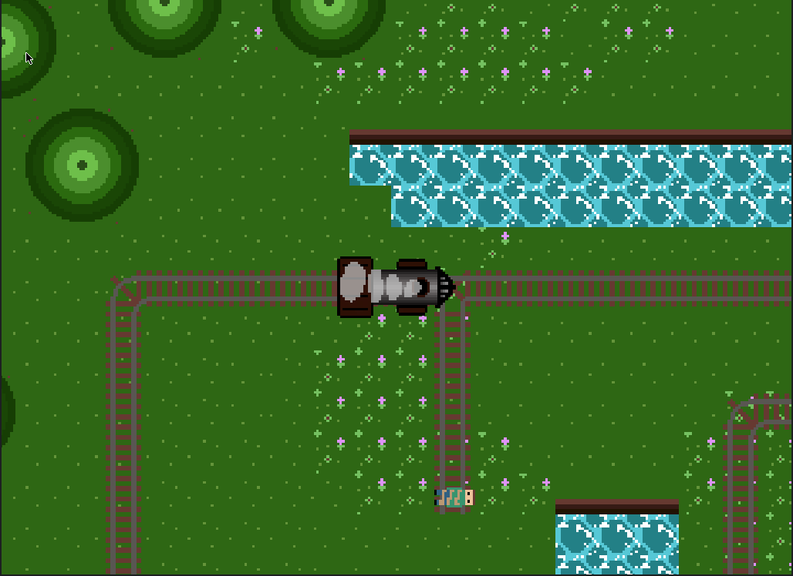
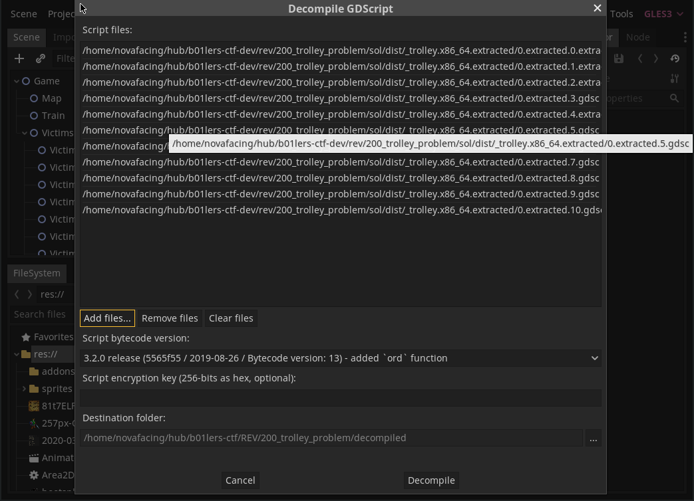

# RE 200 - Trolley

| Author | novafacing |
| --- | --- |
| Point Value | 200 |
| Description | Compiled GDScript game with checker |

So. We get a game! This one looks nicer than Dank Engine.



We can drive around, and there are 8 people that can be run over. So what's the solution to this horrifying trolley problem?

Run over all of them! But in the right order >:)

How do we figure out the right order? Reverse engineer the game. 

Strings will tell us that this is a godot game. We aren't provided with a .pck file this time, so no easy plaintext scripts.

This is pretty representative of a lot of games. They try to do security by obscurity by using packing and file formats to make it hard to RE the game and cheat. EAC, VAC, Denuvo all do security by obscurity at some point. So I did too. Godot allows you to compile all your scripts (in .gd GDscript format) into your game to distribute it as one file. This could theoretically help with security, except that we can extract those compiled scripts. Additionally, it is pretty easy to decompile GDC scripts as they are bytecode (think java bytecode but simpler) so we can get back the original script using https://github.com/bruvzg/gdsdecomp (which is the first result for "godot reverse engineering"). Unfortunately this tool can't just operate on a full binary, we need to either get it a .pck file or separate GDC compiled scripts. Getting the GDC scripts out of the binary is reasonably simple. If we binwalk the program with `binwalk trolley.x86_64`, we'll see an application followed by a lot of STUFF. If we remember from our first .pck file in Dank Engine, binwalk will mis-label a lot of stuff in here because it operates on magic numbers. We see this:

```
35403103      0x21C355F       mcrypt 2.2 encrypted data, algorithm: blowfish-448, mode: CBC, keymode: 8bit
35882479      0x22385EF       mcrypt 2.2 encrypted data, algorithm: blowfish-448, mode: CBC, keymode: 8bit
35926495      0x22431DF       mcrypt 2.2 encrypted data, algorithm: blowfish-448, mode: CBC, keymode: 8bit
36091903      0x226B7FF       mcrypt 2.2 encrypted data, algorithm: blowfish-448, mode: CBC, keymode: 8bit
36144967      0x2278747       mcrypt 2.2 encrypted data, algorithm: blowfish-448, mode: CBC, keymode: 8bit
36157927      0x227B9E7       mcrypt 2.2 encrypted data, algorithm: blowfish-448, mode: CBC, keymode: 8bit
36158023      0x227BA47       mcrypt 2.2 encrypted data, algorithm: blowfish-448, mode: CBC, keymode: 8bit
36240631      0x228FCF7       mcrypt 2.2 encrypted data, algorithm: blowfish-448, mode: CBC, keymode: 8bit
36517927      0x22D3827       mcrypt 2.2 encrypted data, algorithm: blowfish-448, mode: CBC, keymode: 8bit
36716239      0x2303ECF       mcrypt 2.2 encrypted data, algorithm: blowfish-448, mode: CBC, keymode: 8bit
36790969      0x23162B9       mcrypt 2.2 encrypted data, algorithm: blowfish-448, mode: CBC, keymode: 8bit
36927343      0x233776F       mcrypt 2.2 encrypted data, algorithm: blowfish-448, mode: CBC, keymode: 8bit
```
Seems odd that there would be this many encrypted files sitting in here. Let's look at the aforementioned github repo to see how it checks that a file is actually a GDC file.

```
ERR_FAIL_COND_V(p_buffer.size() < 24 || p_buffer[0] != 'G' || p_buffer[1] != 'D' || p_buffer[2] != 'S' || p_buffer[3] != 'C', ERR_INVALID_DATA);
```

Okay, so we have our magic number. We can write a python script to extract all files (roughly) with that magic:

```
import sys

with open(sys.argv[1], "rb") as f:
    contents = f.read()

def findall(bstr, bsub):
    start = 0
    while True:
        start = bstr.find(bsub, start)
        if start == -1:
            return
        yield start
        start += len(bsub)

locs = list(findall(contents, b"GDSC"))
if len(locs) != 0:
    for idx, loc in enumerate(locs):
        if idx + 1 != len(locs):
            script = contents[loc:locs[idx + 1]]
            with open(str(sys.argv[1] + ".extracted." + str(idx)), "wb") as f:
                    f.write(script)
        else:
            script = contents[loc:]
            with open(str(sys.argv[1] + ".extracted." + str(idx)), "wb") as f:
                    f.write(script)
```

And run it with 

`python extract_gdc.py ./trolley.x86_64`

This will give us (about) 10 files. We can now open the GD Reversing tools in Godot and decompile them like so.

Go to RE Tools -> Decompile GDC



This will give us the decompilation of the scripts in the game. The critical script is the following:
```
const static_check = [
        "4b227777d4dd1fc61c6f884f48641d02b4d121d3fd328cb08b5531fcacdabf8a",
        "f5ca38f748a1d6eaf726b8a42fb575c3c71f1864a8143301782de13da2d9202b",
        "ec2e990b934dde55cb87300629cedfc21b15cd28bbcf77d8bbdc55359d7689da",
        "fa2b7af0a811b9acde602aacb78e3638e8506dfead5fe6c3425b10b526f94bdd",
        "82c01ce15b431d420eb6a1febfba7d7a2b69e5bcdcb929cb42cd3e9179d43fc4",
        "011af72a910ac4acf367eef9e6b761e0980842c30d4e9809840f4141d5163ede",
        "e7866fdc6672f827c76f6124ca3eeaff44aff8b7caf4ee1469b2ab887e7e7875",
        "9556b82499cc0aaf86aee7f0d253e17c61b7ef73d48a295f37d98f08b04ffa7f",
        "da4ea2a5506f2693eae190d9360a1f31793c98a1adade51d93533a6f520ace1c",
        "eb1e33e8a81b697b75855af6bfcdbcbf7cbbde9f94962ceaec1ed8af21f5a50f",
        "e629fa6598d732768f7c726b4b621285f9c3b85303900aa912017db7617d8bdb",
        "922c7954216ccfe7a61def609305ce1dc7c67e225f873f256d30d7a8ee4f404c",
        "4e07408562bedb8b60ce05c1decfe3ad16b72230967de01f640b7e4729b49fce",
        "9556b82499cc0aaf86aee7f0d253e17c61b7ef73d48a295f37d98f08b04ffa7f",
        "6b86b273ff34fce19d6b804eff5a3f5747ada4eaa22f1d49c01e52ddb7875b4b",
        "7902699be42c8a8e46fbbb4501726517e86b22c56a189f7625a6da49081b2451"

]

var soln = []

onready  var state = []

func _ready():
        pass

func bin2dec( var binary_value):
        var decimal_value = 0
        var count = 0
        var temp

        while (binary_value != 0):
                temp = binary_value % 10
                binary_value /= 10
                decimal_value += temp * pow(2, count)
                count += 1

        return decimal_value

func vert(arr, index):
        var ret = []
        for memb in arr:
                ret.append(str(memb[index]))
        return ret

func check_solution():
        for i in range(len(state)):
                var ctx = HashingContext.new()
                ctx.start(HashingContext.HASH_MD5)
                var bin = PoolStringArray(state[i]).join("")
                var chval = str(bin2dec(int(bin)))
                soln.append(chval.sha256_text())
        for i in range(len(state)):
                var ctx = HashingContext.new()
                ctx.start(HashingContext.HASH_MD5)
                var bin = PoolStringArray(vert(state, i)).join("")
                var chval = str(bin2dec(int(bin)))
                soln.append(chval.sha256_text())
        for i in range(len(static_check)):
                if static_check[i] != soln[i]:
                        get_tree().quit()

        print(soln[8].substr(8, 2))
        print(soln[4].substr(10, 2))
        print(soln[11].substr(6, 2))
        print(soln[6].substr(47, 2))
        print(soln[9].substr(14, 2))

        print(soln[0].substr(26, 2))
        print(soln[1].substr(17, 2))
        print(soln[4].substr(34, 2))
        print(soln[6].substr(3, 2))
        print(soln[12].substr(3, 2))
        print(soln[9].substr(56, 2))

        print(soln[0].substr(7, 2))

func flip(index):
        if len(state) == 0:
                var last_state = ["0", "0", "0", "0", "0", "0", "0", "0"]
                last_state[index] = "1"
                state.append(last_state)
        else :
                var last_state = state[ - 1].duplicate()
                last_state[index] = "1"
                state.append(last_state)
        if len(state) == 8:
                check_solution()
```

We have an array that has a position flipped to a 1 when you run over someone, then it checks the hashes of those strings interpreted as characters, yada yada. Doesn't matter. We have substr() and we have hex. Grab each of those substrings and it'll spell out the flag: pctf{drift!}
