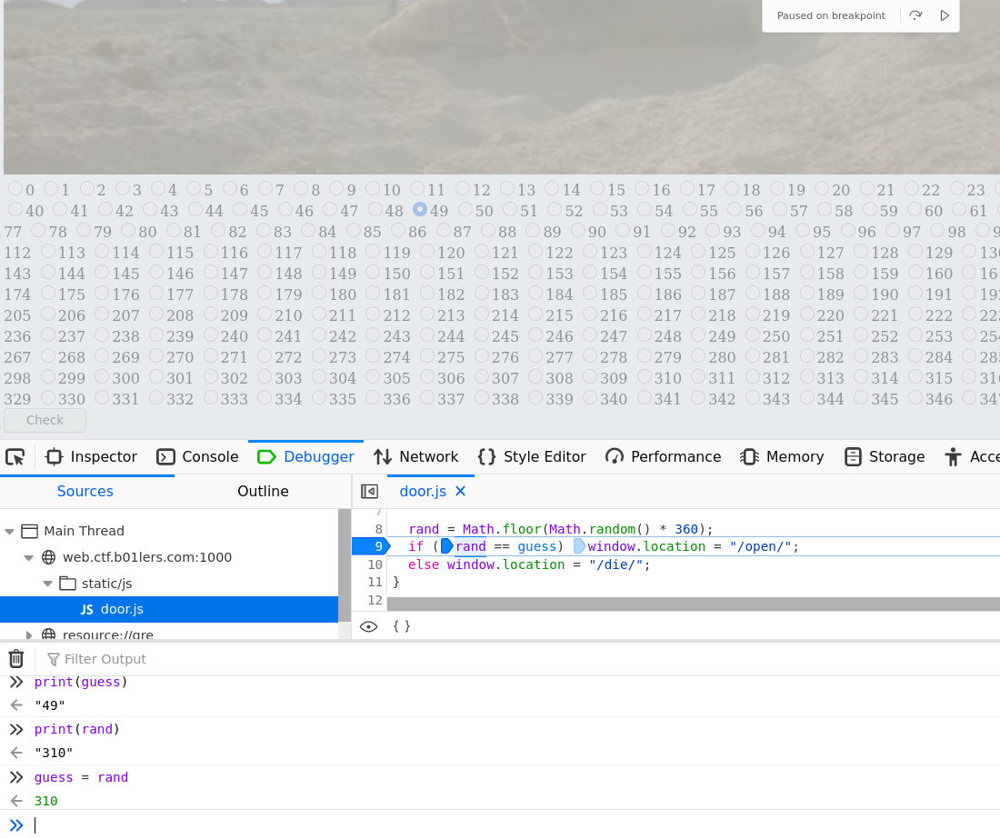

# 00-welcome_to_earth
- A basic html & js chall
- Each page is a different problem and you have to find the next part as a link somewhere in the html or js

## index
- If you press a button you get redirected to /die/ which means you didn't solve the problem in time.
- The next location is /chase/ if escape is pressed
- You can also just manually type in the address for `window.location = "/chase/";` for each of these

## chase
- In the html source, there is a bunch of functions to handle die, left, leftt, right, and right. You can call the leftt function by typing `leftt()` into the web console.

## leftt
- In the html source, there is a comment for a button.
- You can remove the comment by editing the html and removing `<!--` and `-->` and then click the button

## shoot
- Nice, just click the button

## door
- There's 360 radio buttons, each time you submit, it randomly selects one to be right.
- The intended solution is in your browser dev tools js debugger to set a breakpoint at line 9 of the check\_door() function.
- Once it's stopped, you set `guess = rand` and then continue

## open
- This is some stupid recursive calls but it'll open after some long time
- You can set another breakpoint for this one and set the value

## fight
- You have the scramble function so you can just manually put the parts back together, or make an unscramble function.

# Flag:
- pctf{hey_boys_im_baaaaaaaaaack!}
